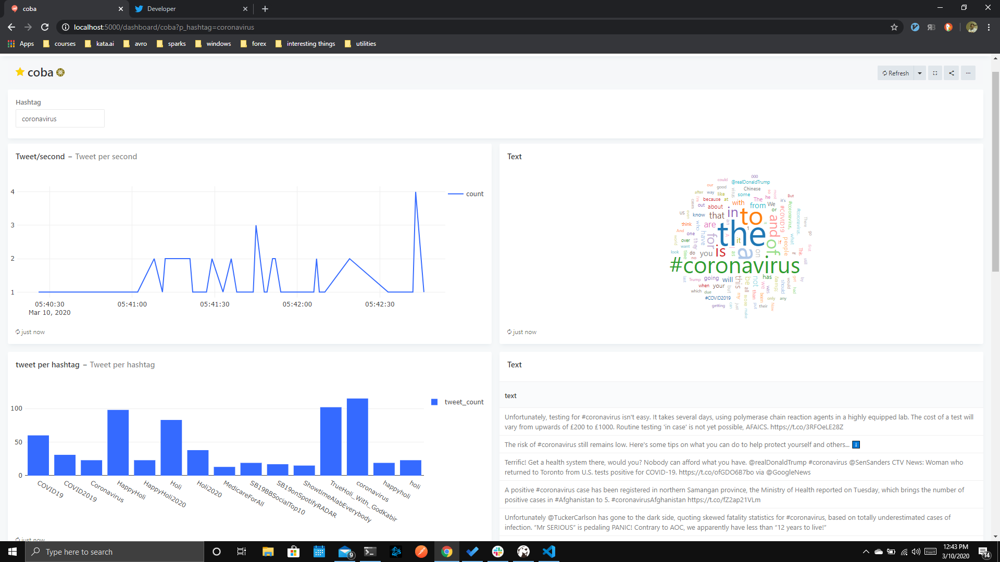
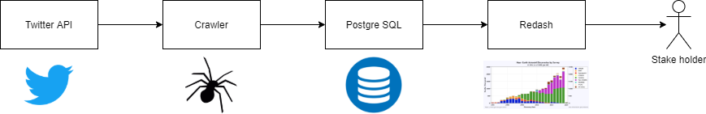
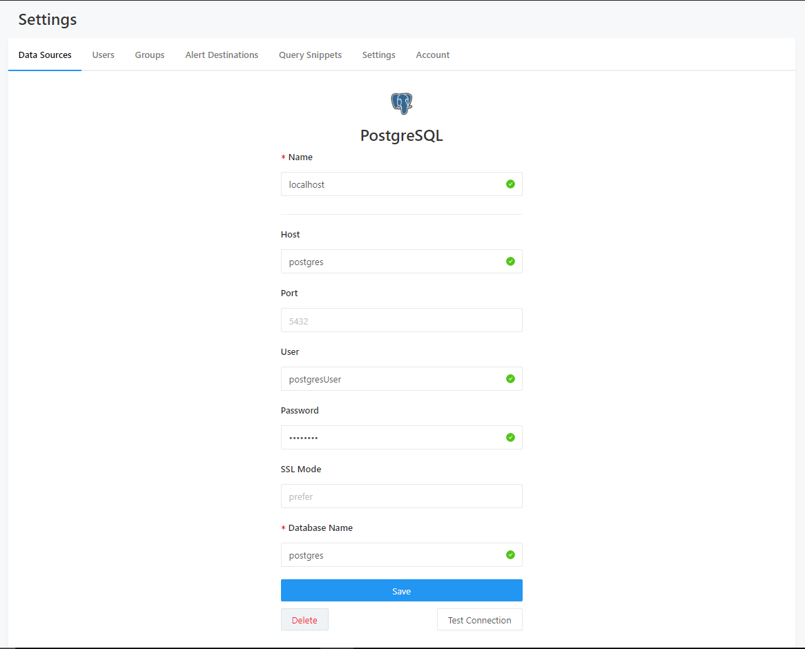

# Apa yang akan kita buat

Crawl data dari twitter, simpan ke postgresql, dan ingest pakai redash:



# Bagaimana semua ini akan bekerja



# Yang dibutuhkan

* docker
* docker-compose
* koneksi internet
* twitter developer account (https://developer.twitter.com/)

# Yang sebenarnya dibutuhkan (di balik layar)

* Python
* Tweepy (Untuk stream tweet dari twitter)
* Postgre SQL (Pakai DB apapun boleh)
* Redash (Untuk query dan visualisasi)

# Apa itu docker

> Docker is a set of platform as a service products that uses OS-level virtualization to deliver software in packages called containers. Containers are isolated from one another and bundle their own software, libraries and configuration files; they can communicate with each other through well-defined channels

Sederhananya: Docker seperti virtual machine dengan share kernel.

## Bagaimana menginstall docker

```
sudo apt-get install docker docker-compose
```

Atau download di [https://www.docker.com/](https://www.docker.com/)

# Apa itu tweepy

Library Python untuk mengakses twitter API [http://www.tweepy.org/](http://www.tweepy.org/)

# Apa itu redash

Data analytic framework [https://redash.io/](https://redash.io/)

# Persiapkan environment

```sh
cp environment.template.env environment.env
vim environment.env # atau buka text editor yang biasa kalian pakai
```

Edit `TWITTER_ACCESS_TOKEN`, `TWITTER_ACCESS_TOKEN_SECRET`, `TWITTER_CONSUMER_KEY`, dan `TWITTER_CONSUMER_SECRET`

dan simpan.

> __PERINGATAN__: Isi environment variable tidak perlu diberi tanda petik

## Persiapkan semua docker container dan jalankan

```sh
docker-compose run --rm server create_db # hanya perlu dilakukan saat run pertama kali
docker-compose up
```

# Akses Redis

Setelah menjalankan `docker-compose up`, kita bisa mengakses dashbaord redis melalui alamat http://localhost:5000

# Membuat Datasource

Setelah membuka dashboard redis, kita bisa membuat datasource dengan mengisikan credential sesuai dengan setting postgre yang ada di environment variable (kebetulan crawler kita juga menyimpan data hasil crawl di postgre).



# Membuat query

Setelah membuat datasource, kita bisa membuat beberapa query yang menarik.

Cobalah membuat query-query berikut dan mengatur visualisasi yang sesuai.

Jumlah tweet per detik (60 terakhir)

```sql
SELECT COUNT(tweet_id), created_at
FROM
    (
        SELECT DISTINCT tweet_id, created_at FROM tweet.statuses ORDER BY created_at DESC LIMIT 60
    ) As tabulated
GROUP BY created_at;
```

Jumlah tweet by hashtag

```sql
SELECT COUNT(tweet_id) as tweet_count, hashtag FROM 
    (SELECT DISTINCT tweet_id, "text", hashtag FROM postgres.tweet.statuses) AS tabulated
GROUP BY hashtag
ORDER BY tweet_count DESC LIMIT 15;
```

Text by hashtag

```sql
SELECT "text" FROM postgres.tweet.statuses WHERE hashtag='{{hashtag}}'
```

# Membuat dashboard

Usai membuat query, kita bisa menambahkan visualisasi nya ke dashboard. Cobalah membuat dashboard seperti ini:


